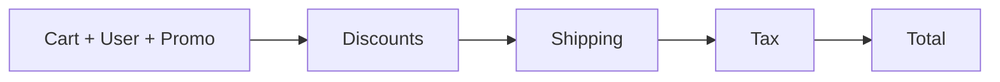
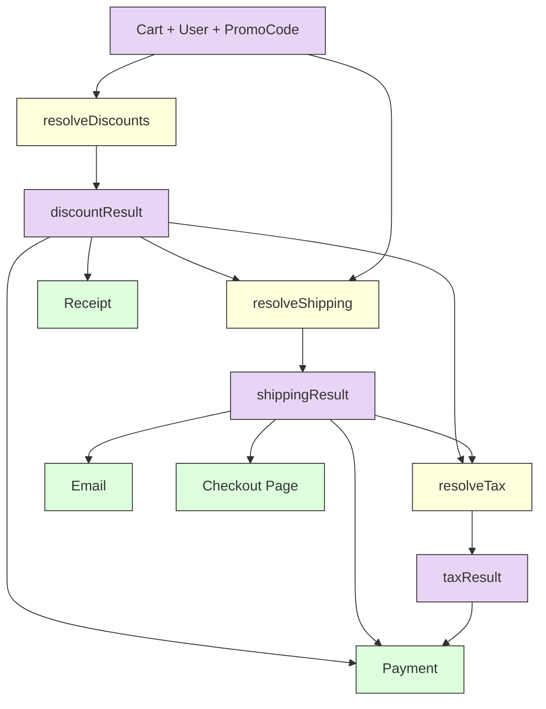
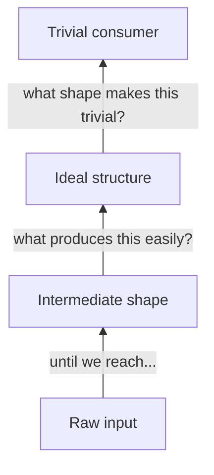

> *"Bad programmers worry about the code. Good programmers worry about data structures and their relationships."* -- Linus Torvalds

One thing I learned over the years is that the best solutions to complex problems don't *look* complex. They look obvious. You read the code and think "well, of course, what else would you do?" — and that feeling of inevitability is not an accident. It's the result of someone spending time thinking about the *shape* of the problem before writing a single line.

I've been chasing this feeling for most of my career. Not always successfully -- I've overcomplicated things plenty of times and learned the hard way that "elegant" and "simple" are not the same thing. But along the way I've developed a mental tool that helps me get there consistently. It's not a framework or a design pattern. It's a way of looking at problems that prevents accidental complexity from creeping in. The core idea: every business process is naturally a pipeline. Data comes in, gets transformed, goes out. When code becomes hard to understand, it's almost never because the business logic is inherently complex -- it's because we've *hidden* the pipeline under layers of ad-hoc checks and scattered logic.

This article is my attempt to explain what I do. First of all, to myself. I've been applying this intuitively for years, but I've never tried to put it into words. So here goes.

## The hidden pipeline

Look at this code. I bet you have seen something like it:

```typescript
function calculateTotal(cart, user, promoCode) {
  let total = cart.subtotal;
  let appliedDiscounts = [];

  if (cart.items.some(i => i.quantity >= 3 && i.eligibleForB2G1)) {
    const cheapest = findCheapestEligible(cart.items);
    total -= cheapest.price;
    appliedDiscounts.push("buy2get1");
  }

  if (user.tier === 'gold' && !appliedDiscounts.includes("SUMMER20")) {
    if (!cart.items.every(i => i.excludedFromLoyalty)) {
      total -= total * 0.10;
      appliedDiscounts.push("loyalty");
    }
  }

  if (promoCode && isValidPromo(promoCode)) {
    const promo = getPromo(promoCode);
    if (promo.exclusive && appliedDiscounts.length > 0) {
      // can't apply
    } else if (!promo.exclusive || appliedDiscounts.length === 0) {
      total -= promo.calculate(total);
      appliedDiscounts.push(promoCode);
    }
  }

  let shippingCost = total > 50 ? 0 : (getWeight(cart) > 10 ? 8.99 : 4.99);
  if (user.subscription === 'prime') shippingCost = 0;

  let tax = calculateTax(total + shippingCost, cart.destination);

  return total + shippingCost + tax;
}
```

Now squint. Forget the `if` statements. What is this function *actually doing*?

It takes a cart, a user, and a promo code. It figures out discounts. Then shipping. Then tax. Then returns a number. That's it. It's a pipeline: input → discounts → shipping → tax → output. The business logic is straightforward. The code is not.

And it gets worse. Somewhere else in the codebase, the receipt renderer needs to show "you saved X", but that information was computed and immediately lost inside this function. The email service needs estimated delivery dates -- not computed here at all. The shipping logic re-checks user tier that was already checked for discounts. The tax calculation depends on a `total` variable that was silently mutated three times before it got there.

The pipeline was always there. We just buried it.


What the code *looks like*:


But what it *actually does*:



## "Just extract methods"

The natural instinct here is to refactor. Extract methods. Maybe wrap it in a class:

```typescript
class OrderCalculator {
  private total: number;
  private appliedDiscounts: string[] = [];

  constructor(private cart, private user, private promoCode) {
    this.total = cart.subtotal;
  }

  calculate() {
    this.applyBuy2Get1();
    this.applyLoyaltyDiscount();
    this.applyPromoCode();
    const shipping = this.calculateShipping();
    const tax = this.calculateTax(shipping);
    return this.total + shipping + tax;
  }

  private applyBuy2Get1() { /* mutates this.total, pushes to this.appliedDiscounts */ }
  private applyLoyaltyDiscount() { /* checks this.appliedDiscounts, mutates this.total */ }
  private applyPromoCode() { /* checks this.appliedDiscounts, mutates this.total */ }
  private calculateShipping() { /* reads this.total, reads this.user */ }
  private calculateTax(shipping) { /* reads this.total */ }
}
```

Looks cleaner, right? The `calculate()` method even reads like a pipeline. But the problems are the same:

- The order of method calls still matters silently. Swap `applyLoyaltyDiscount` and `applyPromoCode` -- no compiler error, wrong result.
- Each method secretly depends on what previous methods did to `this.total` and `this.appliedDiscounts`. The dependencies are hidden in shared mutable state.
- The receipt *still* can't access individual discount amounts. The email *still* doesn't know the estimated delivery date. The consumers are no better off.
- Testing `applyLoyaltyDiscount` in isolation? Good luck -- it depends on the entire object state that previous methods set up.

We gave the mess better names. We did not fix the flow. The pipeline is still hidden -- just behind method boundaries instead of inside one big function.

## Making the pipeline visible

So what's different about the data-first approach? Instead of asking "what are the steps?" I ask a different question: "what does each consumer need, and what data shape would make it trivial to get?"

The receipt needs a list of applied discounts with amounts. The email needs estimated delivery dates. The payment processor needs a final total. The checkout page needs all shipping options with prices. None of these consumers should have to *derive* anything -- they should just read fields.

So I work backwards. What data structure would make the checkout page trivial to render? One that already has `shippingOptions`, `appliedDiscounts`, `totalSaved`, `finalPrice` -- all pre-computed. What would make *that* easy to produce? A resolved discount result that already knows the discounted total. And what makes *that* easy? Rules defined as data, not as nested `if` blocks.

```typescript
const discountRules = [
  { id: "buy2get1", priority: 1, stackable: true, exclusive: false,
    condition: (cart, user) => cart.items.some(i => i.quantity >= 3 && i.eligible),
    apply: (cart) => ({ saved: findCheapestEligible(cart).price }) },
  { id: "loyalty", priority: 2, stackable: true, exclusive: false,
    condition: (cart, user) => user.tier === 'gold',
    apply: (cart, runningTotal) => ({ saved: runningTotal * 0.10 }) },
  { id: "SUMMER20", priority: 3, stackable: false, exclusive: true,
    condition: (cart, user, promo) => promo === "SUMMER20",
    apply: (cart, runningTotal) => ({ saved: runningTotal * 0.20 }) },
];
```

Priority is a number, not code order. Stacking and exclusivity are explicit fields, not interleaved conditions. Adding a new discount means adding a row. Not touching existing logic.

Now the pipeline becomes explicit:

```typescript
// Producer 1: resolve discounts
function resolveDiscounts(cart, user, promoCode, rules) {
  const eligible = rules
    .filter(r => r.condition(cart, user, promoCode))
    .sort((a, b) => a.priority - b.priority);

  const applied = [];
  let runningTotal = cart.subtotal;

  for (const rule of eligible) {
    if (rule.exclusive && applied.length > 0) continue;
    if (!rule.stackable && applied.some(a => !a.exclusive)) continue;
    const result = rule.apply(cart, runningTotal);
    runningTotal -= result.saved;
    applied.push({ ...rule, ...result });
  }

  return { applied, finalTotal: runningTotal, totalSaved: cart.subtotal - runningTotal };
}

// Producer 2: resolve shipping (needs discounted total as input)
function resolveShipping(cart, user, discountResult, rules) {
  const { finalTotal } = discountResult;
  const weight = cart.items.reduce((sum, i) => sum + i.weight * i.quantity, 0);

  return {
    options: rules
      .filter(r => r.condition(finalTotal, weight, user, cart.destination))
      .map(r => ({
        id: r.id, label: r.label,
        cost: r.cost(finalTotal, weight),
        estimatedDays: r.estimatedDays(cart.destination),
      })),
  };
}

// Producer 3: resolve tax (needs both previous results)
function resolveTax(discountResult, shippingResult) {
  const taxableAmount = discountResult.finalTotal + shippingResult.options[0].cost;
  return { totalTax: taxableAmount * 0.08, taxableAmount };
}
```

And the consumers? Trivial:

```typescript
const discounts = resolveDiscounts(cart, user, promoCode, discountRules);
const shipping = resolveShipping(cart, user, discounts, shippingRules);
const tax = resolveTax(discounts, shipping);

// Receipt: discounts.applied.map(d => `${d.id}: saved ${d.saved}`)
// Email: shipping.options[0].estimatedDays
// Payment: discounts.finalTotal + shipping.options[0].cost + tax.totalTax
// Checkout page: renders shipping.options as selectable cards
```

Flow is clearly visible:



🟡 Producer  🟣 Data  🟢 Consumer

Look at what happened. The dependencies between stages are now *explicit*: `resolveShipping` takes `discountResult` as a parameter. You literally cannot call it without discounts being resolved first. Try reordering these lines -- the compiler will stop you. In the original code, reordering `if` blocks broke things silently.

Each producer is independently testable: pass in mock inputs, assert on outputs. No shared mutable state. No setup of "the right object state." Just data in, data out.

And every consumer downstream (receipt, email, payment, checkout page) just reads pre-computed fields. No re-derivation. No scattered checks. The pipeline is visible, and each piece is simple.

## Producers and consumers

After doing this across different projects and languages for years, I noticed a pattern. In pipeline-driven code, every piece falls into one of two roles.

**Producers** encapsulate complexity. They take raw data and generate something enriched, shaped for a specific use case. The discount resolver above is a producer. A hook that computes user roles from raw API data is a producer. A query builder that transforms a flat JSON request into a typed AST is a producer. This is where the hard logic lives, and that's fine, because it lives in *one place*.

**Consumers** are simple and direct. They receive pre-computed data and act on it. Often just checking one or two fields that already convey intent. The receipt that maps `discounts.applied` to line items is a consumer. A component that checks `roles.includes("approver")` is a consumer. If your consumer has complex logic in it, that's a smell: something upstream should have prepared the data better.

> Concentrate complexity in producers, make consumers stupid.

Producers can chain and the output of one becomes the input of the next. They can branch and one producer feeds multiple consumers at a fork point. They can nest and a component can be both a consumer of data from above and a producer for its children. It's not a linear chain. It's a topology.

But the boundaries between them should always be plain data structures. Objects, records, maps -- something you can log, serialize, and test against. Not operational interfaces. Not classes with methods you need to call in the right order. Just data. That's what makes the whole thing composable.

## Work backwards from the consumer

Here is how I approach it in practice.



Start with the end. What's the final thing you need to do? Render a page. Generate SQL. Send a response. That's your terminal consumer. Now ask: what data structure would make that *trivial*? Not possible -- trivial. What shape of data would let the consumer be three lines of code?

For the checkout page, it's an object with `shippingOptions`, `discounts`, `finalPrice` -- all pre-computed. For a SQL generator, it's a typed AST where each node maps 1:1 to a SQL clause. For a React component, it's props that map directly to what's displayed.

Now work backwards. To produce that ideal structure, what intermediate shape (closer to the raw input) would make the transformation easy? And what feeds into *that*? Keep going until you reach the input format, which you usually cannot change.

You end up with a chain of intermediate data structures, each one a stepping stone. The transformations between them are usually simple, because you *designed* the shapes to make them simple. You are not designing algorithms. You are designing data shapes. The algorithms emerge as trivial bridges between well-chosen shapes.

This is an iterative process. Over time, producers split and merge. You notice one producer doing too much -- split it into two with a clearer intermediate shape between them. You notice two producers that always run together and nobody needs the data in between -- collapse them into one for simplicity or performance. The pipeline is not set in stone. It evolves with your understanding of the problem and the needs of your consumers.

## This is not new

There is a thread running through 50 years of software engineering, each generation restating the same insight.

Rob Pike in 1989: *"Data dominates. If you've chosen the right data structures and organized things well, the algorithms will almost always be self-evident."*

Eric Raymond in 2003: *"Fold knowledge into data, so program logic can be stupid and robust."*

Linus Torvalds in 2006: *"I'm a huge proponent of designing your code around the data, rather than the other way around, and I think it's one of the reasons git has been fairly successful."*

Same idea. Decades apart. And yet most codebases I encounter still think algorithm-first. We know this stuff intellectually, but we don't practice it. Maybe because nobody showed us *how* -- just *that* it matters. Steve McConnell's [table-driven methods](https://www.oreilly.com/library/view/code-complete-2nd/0735619670/ch18.html) were my first exposure to the "how." Scott Wlaschin's [railway-oriented programming](https://fsharpforfunandprofit.com/rop/) was the next step. But it took me years of applying these ideas — sometimes badly — to arrive at the pipeline model I use today.

## The pitfall: don't worship the pipe

I have to be honest. When I first discovered F# and the `|>` operator, I went overboard. Everything had to be a pipe. Filter, map, reduce — the holy trinity. Code that read as `x |> f |> g |> h` felt *right*. I started forcing every piece of logic into this shape, and it was a fun mind game, but not always a good idea.

The worst case: I once built a message processing system in C#, trying to imitate railway-oriented programming. Every operation had to be a link in the chain. The result: 80% of the logic ended up crammed into a monstrous `.Aggregate()` call, just to maintain pipe purity. The code was technically a pipeline, but it was unreadable, undebuggable, and worse than the imperative version it replaced. I sacrificed clarity for dogma.

The lesson took me a while to internalize: the pipeline is a *mental model* for how data flows through your system. It is not a mandate to literally chain everything into one expression. Sometimes a producer is three lines of imperative code that builds a convenient object. That's fine. Nobody cares whether your producer uses a `for` loop or a `.reduce()` internally. What matters is that it takes clear inputs and produces a clean data structure for the next stage.

The syntax is not the point. The data flow is.

*(I still prefer reduce though.)*

One more thing to keep in mind: intermediate data structures are not free. If you're processing millions of records or running on constrained hardware, the overhead of creating a new shape at every stage may matter. The escape hatch is straightforward: collapse producers, use lazy evaluation, or accept a less pure structure in the hot path. The mental model still applies; you just optimize the implementation where it counts.

## The assembly line

I like to think of it as an assembly line. Raw materials enter at one end. Each station has a simple, well-defined job. No station needs to understand the whole product. No station re-does what the previous one already did. The complexity of the final product emerges from the *sequence of simple steps*, not from any single brilliant station.

Your code can work the same way. Each producer is a station. Each data shape between stations is a well-defined intermediate product. The final consumer (the checkout page, the SQL query, the API response) is just the last station that packages the finished product.

The pipeline was always there. You just need to see it. And once you do, you stop writing algorithms and start designing data shapes. The algorithms follow.

> *"Show me your tables, and I won't usually need your flowcharts; they'll be obvious."* -- Fred Brooks, 1975

P.S. LISP-family languages took this idea to its logical extreme: what if the data flowing through your pipeline *was itself code*? But that's a story for another article.

---
## References

- Steve McConnell, [*Code Complete* — Table-Driven Methods](https://www.oreilly.com/library/view/code-complete-2nd/0735619670/ch18.html) (2004) — replacing branching logic with data lookups.
- Scott Wlaschin, [Railway-Oriented Programming](https://fsharpforfunandprofit.com/rop/) (2014) — modeling success/failure paths as data.
- Scott Wlaschin, [*Domain Modeling Made Functional*](https://pragprog.com/titles/swdddf/domain-modeling-made-functional/) (2018) — encoding business rules in types.
- Rich Hickey, [The Value of Values](https://www.infoq.com/presentations/Value-Values) (2012) — why values beat places.
- Yehonathan Sharvit, [*Data-Oriented Programming*](https://www.manning.com/books/data-oriented-programming) (2022) — separating code from data, language-agnostic.
- Mike Acton, [Data-Oriented Design](https://www.youtube.com/watch?v=rX0ItVEVjHc) (CppCon 2014) — "The purpose of all programs is to transform data."

----
*Cover Photo by [Shubham Dhage](https://unsplash.com/@theshubhamdhage?utm_source=Obsidian%20Image%20Inserter%20Plugin&utm_medium=referral) on [Unsplash](https://unsplash.com/?utm_source=Obsidian%20Image%20Inserter%20Plugin&utm_medium=referral)*