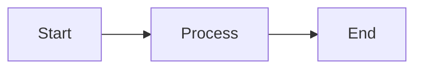

*Photo by [Kirsten Drew](https://unsplash.com/@k_drew?utm_source=Obsidian%20Image%20Inserter%20Plugin&utm_medium=referral) on [Unsplash](https://unsplash.com/?utm_source=Obsidian%20Image%20Inserter%20Plugin&utm_medium=referral)*

Welcome to Gulenok's blog! This is a test article to verify the content pipeline works.

## A subheading

Some text with **bold** and *italic* formatting.

- List item one
- List item two
- List item three

## Mermaid test



## ExcaliDraw Test

![[Nice Drawing.excalidraw|100%]]

## Code Text

This is `monospace part`

```tsx
const Test = ({label}: {label: string}) => {
    return (<div>{label}</div>)
}
```
